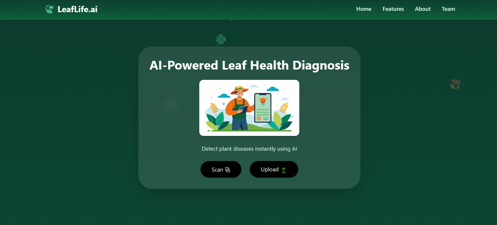
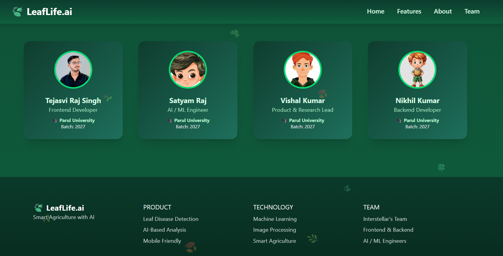

# 🌿 LeafLive.ai

LeafLive.ai is an AI-powered **Plant Disease Detection Web Application** that helps users identify plant diseases by uploading leaf images. The platform provides fast, accurate results along with disease details and prevention tips.

---

  

---
# Visit the Project

 
 👉 [Visit the Live Website](https://leaflifeai.netlify.app/)

---
## 🚀 Features

- 🌱 Upload plant leaf images
- 🤖 AI-based disease prediction
- 📊 Disease details & symptoms
- 💡 Prevention and treatment suggestions
- 📱 Responsive UI (Mobile & Desktop)
- ⚡ Fast and user-friendly interface

---
# Team Members and About Project Footer.

  

---
### Frontend
- HTML5  
- CSS3  
- JavaScript  
- React.js  

### Backend (Optional / Future Scope)
- Node.js  
- Express.js  

### AI / ML (Optional)
- Python  
- TensorFlow / PyTorch  
- CNN Model  

---

## 📂 Project Structure

LeafLive.ai/
│
├── public/
│ ├── index.html
│ └── favicon_io/
│
├── src/
│ ├── components/
│ ├── assets/
│ ├── App.js
│ ├── index.js
│ └── style.css
│
├── package.json
├── README.md
└── .gitignore